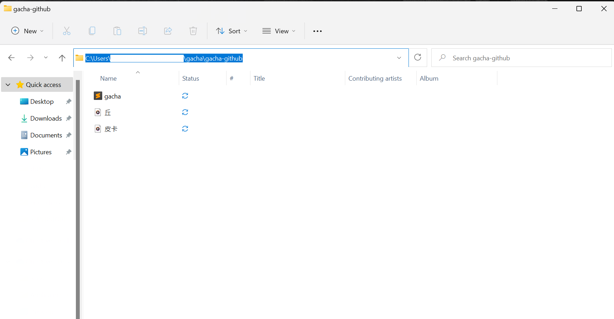

# 怪物彈珠轉蛋機率(信仰)

## 主程式

* gacha.py

### 前置設定與使用說明

 

要使用此py檔之前，必須先進行以下設定

* 主程式指定區塊之修改
    1. BLOCK 1: 將playsound(r'C:\\Users\\gacha\\皮卡(丘).wav') 更改為"皮卡.wav"以及"丘.wav"檔案所在資料夾的完整路徑，詳細如下圖所示，注意 **`windows路徑中的"\"在python裡為"\\"`**，若不想要此程式有聲音，也可以選擇將BLOCK 1中逐行註解(加上#)。 
    

 

* 網頁中每一分鐘會更新一次轉蛋機率資訊，而此程式預設為每10秒抓取一次資訊，若更新後的機率>15，且不等於前值，便會發出提示音。
